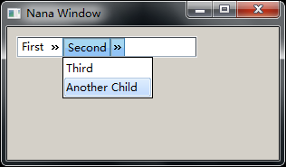
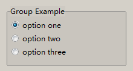
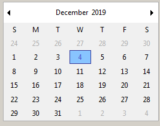

# An introduction to the widgets
 
Name | ..........................Picture............................
-----|----------------------
\link nana::button button\endlink,  [ Manual ](http://nanapro.org/en-us/documentation/widgets/button.htm) Responds to user clicks.| 
\link nana::categorize categorize\endlink, Represent an architecture of categories and what category is chosen. The categorize widget can be used for representing a path of a directory or the order of a hierarchy. | 
\link nana::checkbox checkbox\endlink,  [ Manual  ](http://www.nanapro.org/en-us/documentation/widgets/checkbox.htm), User toggles a boolean. With the radio mode, users make a choice among a set of mutually exclusive, related options. Users can choose one and only one option.  | inside a group   
\link nana::combox combox\endlink,  [ Manual  ](http://nanapro.org/en-us/documentation/widgets/combox.htm)  User selects from drop-down list. This widget is a combo box which consists of a list box combined with a textbox. The list box should drop down when the user selects the drop-down arrow next to the control. The text can be editable.  | 
\link nana::date_chooser date_chooser\endlink ,  [ Manual  ](http://www.nanapro.org/en-us/documentation/widgets/date_chooser.htm) A graphical user interface for choosing a date. |   
\link nana::form form\endlink ,  [ Manual  ](http://www.nanapro.org/en-us/documentation/widgets/form.htm) Represents a popup window. Overall it is a root widget, which attaches the OS/Windowing system native window. |   
\link nana::group group\endlink,  [ Manual  ](http://www.nanapro.org/en-us/documentation/widgets/group.htm) A group box provides a frame, a title, and displays various other widgets inside itself. It automatically lays out the child widgets if these child widgets are inserted into the group internal place field.  |    see also spinbox and checkbox images
\link nana::label label\endlink,   [Manual](http://nanapro.org/en-us/documentation/widgets/label.htm) It can be a very simple static text, or a sofisticated formated, aligned and responsible to commands (enter, leave and click) dynamic text label including imagenes. You can get the precalculated exact size. Examples: [1](https://github.com/qPCR4vir/nana-demo/blob/master/Examples/label_listener.cpp)    |   
\link nana::listbox listbox\endlink,  [Manual](http://nanapro.org/en-us/documentation/widgets/listbox.htm) list of categories with in turn contain items. A category is a text that can be expanded to show the items. Cotegories and items can be selected and checked. An item is formed by columns (fields) corresponding to the headers. Drag the header to reisize or reorganize it. Click on a header reorder the list up and down alternatively | 
\link nana::menu menu\endlink, [ Manual](http://www.nanapro.org/en-us/documentation/widgets/menu.htm) A list of items that specify options or group of options for an application. |   
\link nana::menubar menubar\endlink, [ Manual ](http://www.nanapro.org/en-us/documentation/widgets/menubar.htm) Is a toolbar at the top of window for popuping menus. |   
\link nana::nested_form nested_form\endlink, [Manual ](http://nanapro.org/en-us/documentation/widgets/nested_form.htm) Represents a native window to be a child of other form. Overall it is a root widget(see Overview of widgets) which attaches the OS/Windowing system native window. It represents a form as a child of other form, using this feature, you can dock other native windows to the nested form, such as a web browser ActiveX control. |   
\link nana::panel panel\endlink,  [ Manual ](http://nanapro.org/en-us/documentation/widgets/panel.htm) For placing other widgets |   
\link nana::picture picture\endlink,  [Manual ](http://nanapro.org/en-us/documentation/widgets/picture.htm) Rectangle area for displaying an image.  |   
\link nana::progress progress\endlink,  [ Manual  ](http://nanapro.org/en-us/documentation/widgets/progress.htm) A progress bar with two possible styles: known amount, and unknown amount value (goal). In unknown style the amount is ignored and the bar is scrolled when value change. |   
\link nana::scroll scroll\endlink,  [Manual  ](http://nanapro.org/en-us/documentation/widgets/scroll.htm) Provides a way to display an object which is larger than the window's client area. |   
\link nana::slider slider\endlink,   [ Manual ](http://nanapro.org/en-us/documentation/widgets/slider.htm) User selects value from graphical number range by draging for tracking. |   
\link nana::spinbox spinbox\endlink,  [Manual](https://github.com/qPCR4vir/nana-docs/wiki/Spinbox). Choose a value in the specified range. Supports groups of integers, doubles or texts.| 
\link nana::toolbar toolbar\endlink,  [Manual  ](http://nanapro.org/en-us/documentation/widgets/toolbar.htm) a control bar that contains buttons  |  
\link nana::tabbar tabbar\endlink,  [ Manual ](http://nanapro.org/en-us/documentation/widgets/tabbar.htm) Analogous to dividers in a notebook or the labels in a file cabinet. |   
\link nana::textbox textbox\endlink,   Provides a widget that is used to input and display text. It supports three modes: single line, multiple lines and line wrap.| 
\link nana::treebox treebox\endlink,  [ Manual](http://nanapro.org/en-us/documentation/widgets/treebox.htm) Displays a hierarchical list of items, such as the files and directories on a disk. The nodes contain a text and can be (events) expanded, checked, selected and hovered. Data of `any` type can be optionally atached to each node using [item_proxy:Manual](http://nanapro.org/en-us/documentation/widgets/treebox-item_proxy.htm)   |   
\link nana::frame frame\endlink,   
\link nana::radio_group radio_group\endlink,   User selects from displayed options.
* [base widget](http://nanapro.org/en-us/documentation/page.php?u=/widgets/widget) Stuff every widget can do.
* [menu](https://github.com/qPCR4vir/nana-docs/wiki/Widget-menu) User selects from pop-up list.
* [filebox](https://github.com/qPCR4vir/nana-docs/wiki/Widget-filebox) User selects file.
* [messagebox](https://github.com/qPCR4vir/nana-docs/wiki/Message-box) Display pop-up window with message.
* [inputbox](https://github.com/qPCR4vir/nana-docs/wiki/inputbox) User selects multiple values

 

 

 

 